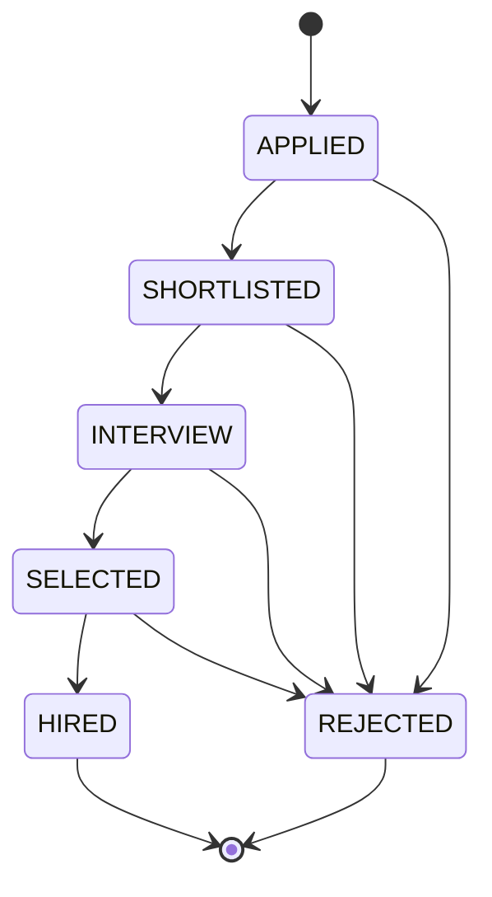
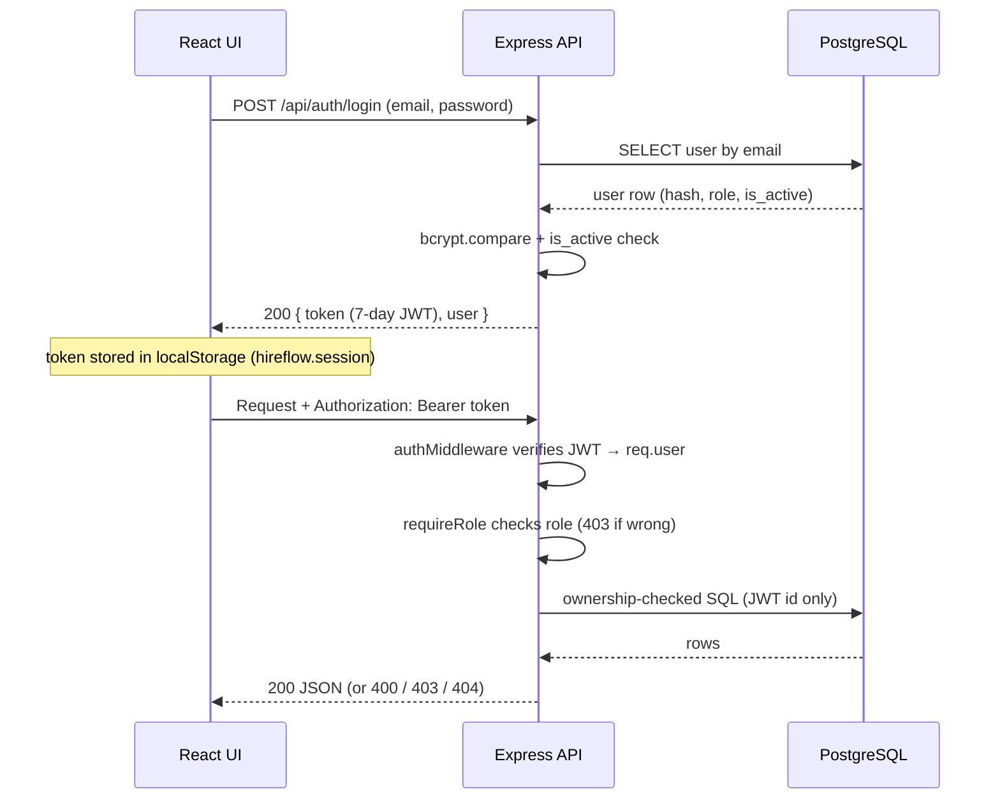
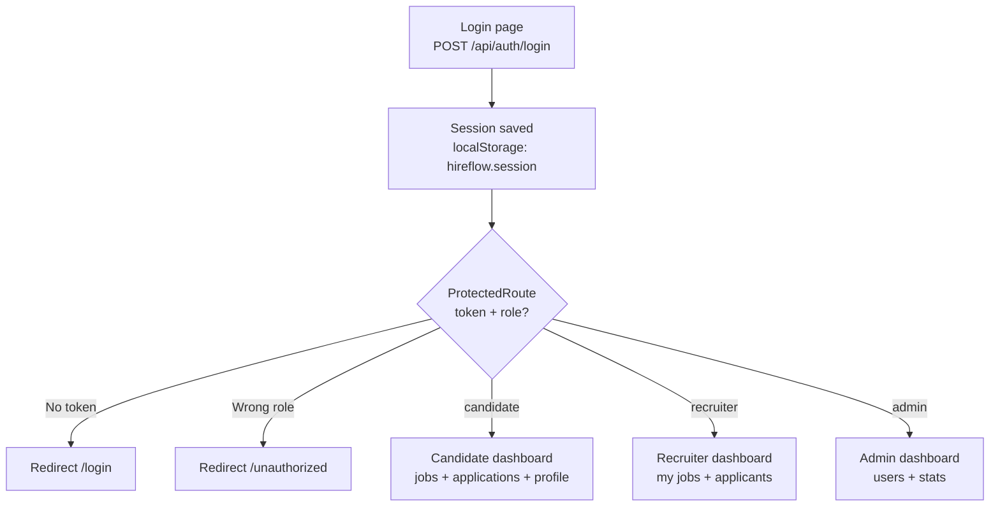
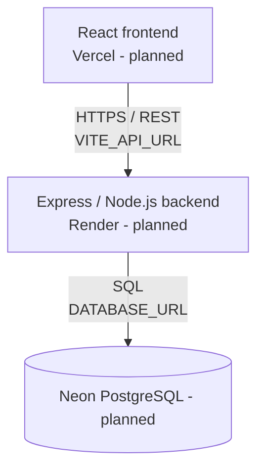
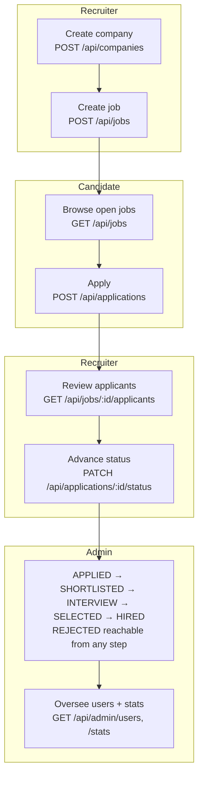
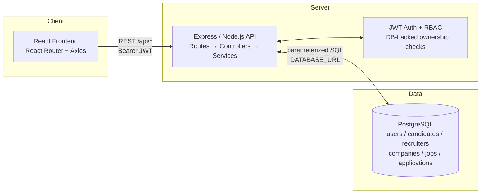

# HireFlow

A full-stack Applicant Tracking System for managing jobs, candidates, applications, and recruitment workflows.

## Table of Contents

- [Project Overview](#project-overview)
- [Technology Stack](#technology-stack)
- [Key Features](#key-features)
- [Application Status Workflow](#application-status-workflow)
- [Authentication \& Authorization](#authentication--authorization)
- [Database Design](#database-design)
- [Backend Architecture](#backend-architecture)
- [API Documentation](#api-documentation)
- [Frontend](#frontend)
- [Security](#security)
- [Testing](#testing)
- [Project Structure](#project-structure)
- [Local Setup](#local-setup)
- [Environment Variables](#environment-variables)
- [Production Deployment](#production-deployment)
- [Live Demo](#live-demo)
- [GitHub Repository](#github-repository)
- [Recruitment Workflow](#recruitment-workflow)
- [Architecture Diagram](#architecture-diagram)
- [Resume / Technical Highlights](#resume--technical-highlights)
- [Future Improvements](#future-improvements)
- [Disclaimer](#disclaimer)

## Project Overview

HireFlow is a full-stack web application that implements a basic Applicant Tracking System (ATS). It connects three roles — candidates, recruiters, and admins — around a single recruitment pipeline stored in a relational PostgreSQL database.

The problem it solves: without an ATS, job postings, applications, and hiring decisions live in disconnected spreadsheets and inboxes. HireFlow centralizes them so:

- **Candidates** browse open jobs, submit applications, and track each application's status.
- **Recruiters** create companies and jobs, review applicants for jobs they own, and advance applications through a controlled status pipeline.
- **Admins** oversee platform users (list, deactivate) and view platform-level stats (users, jobs, applications, open vs. closed jobs).

The main workflow is: recruiter creates a company and a job → candidate views the open job → candidate applies → recruiter reviews the applicant → recruiter advances the application through `APPLIED → SHORTLISTED → INTERVIEW → SELECTED → HIRED`, with `REJECTED` available as a terminal branch at each step.

The stack is React.js (Vite) on the frontend, Node.js with Express.js exposing REST APIs on the backend, and PostgreSQL as the relational database. Authentication uses JWT Authentication with bcrypt password hashing, and authorization uses Role-Based Access Control (RBAC) enforced at the backend/API level.

## Technology Stack

Every technology below is actually used in this repository (verified against `hireflow-backend/package.json` and `hireflow-frontend/package.json`). For each one: why it was chosen, what benefit it gives HireFlow, a concrete example from the code, and its future scope.

### React.js 19 (frontend UI)

- **Why used:** component-based UI library. Each dashboard, page, and widget (job cards, status badges, data tables) is an isolated, reusable component, which keeps the three role-based interfaces (candidate, recruiter, admin) maintainable.
- **Benefits:** declarative rendering (UI updates automatically when state changes), a large ecosystem, and easy code reuse across roles.
- **Example in HireFlow:** `hireflow-frontend/src/components/JobCard.jsx` renders a job everywhere it is needed, and `StatusBadge.jsx` renders application statuses consistently on both candidate and recruiter screens.
- **Future scope:** route-level code splitting for faster loads, data-fetching libraries (e.g. React Query) with caching, and expanded component reuse as new pages are added.

### Vite 8 (build tool / dev server)

- **Why used:** fast development server with instant hot reload and an optimized production build, replacing slower traditional bundlers for development.
- **Benefits:** near-instant feedback while building UI pages, and small production bundles via `vite build`.
- **Example in HireFlow:** `npm run dev` serves the frontend during development; `npm run build` produces the production bundle (configured in `hireflow-frontend/package.json` with `@vitejs/plugin-react`).
- **Future scope:** preview deployments per pull request, bundle analysis, and progressive-web-app support.

### React Router 7 (client-side routing)

- **Why used:** maps URLs to pages without full-page reloads and enables role-based navigation guards in a single-page application.
- **Benefits:** clean URLs per role, nested layouts (one layout wrapping several pages), and centralized access control on the frontend.
- **Example in HireFlow:** `/candidate/applications`, `/recruiter/jobs/:jobId/applicants`, and `/admin/stats` are nested under role layouts in `src/App.jsx`, all gated by `ProtectedRoute` (wrong role → `/unauthorized`).
- **Future scope:** lazy-loaded routes for faster initial load, and deeper nested routes (e.g. per-application detail pages).

### Axios (HTTP client)

- **Why used:** a single configured HTTP client for all frontend-to-backend communication, with interceptors that attach the JWT automatically.
- **Benefits:** no repeated auth-header code in pages, consistent error shapes, and one place (`VITE_API_URL`) controlling the backend address.
- **Example in HireFlow:** `src/api/axiosInstance.js` creates the only Axios instance and injects `Authorization: Bearer <token>` from the stored session on every request.
- **Future scope:** automatic token-refresh-and-retry interceptors and request cancellation for fast filter typing.

### Node.js (backend runtime)

- **Why used:** runs JavaScript on the server, so the whole project uses one language (JavaScript) across frontend and backend, and its event-driven model suits an I/O-heavy REST API.
- **Benefits:** shared language and tooling (npm) between both halves, and efficient handling of many concurrent API/database requests.
- **Example in HireFlow:** `hireflow-backend/src/index.js` boots the API and reads `PORT` / `DATABASE_URL` from the environment.
- **Future scope:** keeping current with LTS releases, and horizontal scaling (multiple instances behind a host load balancer) when usage grows.

### Express.js 4 (web framework)

- **Why used:** minimal, middleware-based framework for defining REST routes and layering cross-cutting concerns (auth, role checks, error handling).
- **Benefits:** small learning curve, explicit request pipeline, and per-route middleware composition (e.g. auth + role required on one route, public on another).
- **Example in HireFlow:** `src/app.js` mounts resource routers (`/api/jobs`, `/api/applications`, `/api/admin`, …), while `jobRoutes.js` mixes a public list route with recruiter-only write routes in one file.
- **Future scope:** rate limiting and request logging middleware, and an upgrade path to newer Express versions.

### REST APIs (architectural style)

- **Why used:** resource-oriented HTTP endpoints (`GET/POST/PUT/PATCH`) give a predictable contract that any client (web, mobile, third party) can consume.
- **Benefits:** stateless requests, standard status-code semantics (400/401/403/404/409 used consistently in HireFlow), and frontend/backend independence.
- **Example in HireFlow:** `POST /api/applications` (409 on duplicate), `PATCH /api/applications/:id/status` (400 on illegal transition) — the frontend only renders what the API contract guarantees.
- **Future scope:** pagination on list endpoints, API versioning (`/api/v1`), and generated API documentation (e.g. OpenAPI).

### PostgreSQL (relational database)

- **Why used:** recruitment data is inherently relational (users ↔ profiles ↔ companies ↔ jobs ↔ applications), and integrity rules (no duplicate applications, valid statuses, owned records) belong in the database, not just in application code.
- **Benefits:** foreign keys, `UNIQUE` constraints, `CHECK` constraints, and transactions guarantee correctness even under concurrency or bugs in calling code.
- **Example in HireFlow:** `UNIQUE (job_id, candidate_id)` on `applications` is the source of truth blocking duplicate applications, and the status `CHECK` constraint rejects invalid states at the DB level (`hireflow-backend/database/schema.sql`).
- **Future scope:** managed hosting (Neon PostgreSQL — planned, not yet configured), read replicas, full-text job search, and additional indexes as data grows.

### node-postgres (`pg` driver)

- **Why used:** the standard PostgreSQL client for Node.js; used directly (no ORM) so every query is explicit and auditable.
- **Benefits:** connection pooling for concurrent API requests, parameterized `$1`-style queries that prevent SQL injection, and full control over SQL.
- **Example in HireFlow:** `src/db/pool.js` holds a lazy singleton pool built from `DATABASE_URL`, with a `setPool` hook for swapping pools.
- **Future scope:** pool sizing tuned to the host, prepared statements for hot queries, and optionally a query builder if the query surface grows significantly.

### JSON Web Tokens (`jsonwebtoken` library)

- **Why used:** stateless authentication — the server verifies each request from the token itself instead of storing sessions, which keeps the API stateless and horizontally scalable.
- **Benefits:** no server-side session store, role travels inside the verified token, and expiry is built in.
- **Example in HireFlow:** login returns a 7-day token (`expiresIn: '7d'`); `auth.middleware.js` verifies `Authorization: Bearer <token>` and sets `req.user = { id, role }` for downstream role and ownership checks.
- **Future scope:** short-lived access tokens with rotating refresh tokens, and token revocation (blocklist) tied to admin deactivation.

### bcrypt (`bcryptjs` library)

- **Why used:** adaptive password hashing — passwords are never stored in plaintext, and the cost factor makes brute-force attacks expensive.
- **Benefits:** per-password salts built in, tunable work factor, and a pure-JavaScript implementation with no native build step.
- **Example in HireFlow:** `authService.js` hashes with cost factor 10 at register and uses `bcrypt.compare` at login, returning a generic 401 that leaks neither email existence nor password correctness.
- **Future scope:** raising the cost factor as hardware improves, and enforcing password-strength rules at registration.

### dotenv (environment configuration)

- **Why used:** loads secrets and environment-specific settings from `.env` files so no credential is hardcoded in source.
- **Benefits:** same code runs in development and production with different config; `.env` is git-ignored while `.env.example` documents what is needed.
- **Example in HireFlow:** `DATABASE_URL`, `JWT_SECRET`, `PORT`, and `FRONTEND_URL` are read from `hireflow-backend/.env` (see `.env.example`); the server exits with a clear message if `DATABASE_URL` is missing.
- **Future scope:** managed secret stores on hosting platforms instead of files in production.

### CORS (`cors` middleware)

- **Why used:** browsers block cross-origin API calls by default; the backend must explicitly allow the frontend origin while rejecting everything else.
- **Benefits:** the API accepts requests only from the known frontend, reducing exposure to untrusted web origins.
- **Example in HireFlow:** `app.js` allows a single origin from `FRONTEND_URL`, defaulting to `http://localhost:5173`.
- **Future scope:** an explicit allowlist of production origins once deployed.

### oxlint (linter)

- **Why used:** fast static analysis that catches unused variables, bad imports, and common React mistakes before they reach review or production.
- **Benefits:** runs in milliseconds, keeps the codebase consistent, and gates quality (`npm run lint` must stay at 0 warnings/errors).
- **Example in HireFlow:** `npm run lint` in `hireflow-frontend/` is the recorded frontend quality check.
- **Future scope:** linting the backend as well, plus formatting and CI enforcement on every pull request.

### Git / GitHub (version control)

- **Why used:** tracks every change, enables branching and review, and hosts the canonical repository.
- **Benefits:** full history (`git log`), safe experimentation, and collaboration through pull requests.
- **Example in HireFlow:** repository at `https://github.com/shalu20-g/hireflow`; `TASKS.md` tracks completed vs. remaining work.
- **Future scope:** CI/CD pipelines (lint + build + future tests on every push) and protected main-branch reviews.

### Planned hosting: Vercel, Render, Neon PostgreSQL

- **Why planned:** Vercel fits Vite static builds, Render fits a Node.js API process, and Neon provides managed serverless PostgreSQL — matching this stack without server management.
- **Status:** not yet configured — no deployment configs, Docker files, or live URLs exist in the repository (`TASKS.md` lists production deployment as future work). See [Production Deployment](#production-deployment).
- **Future scope:** frontend on Vercel, backend on Render, database on Neon, with HTTPS, managed secrets, and preview environments.

## Key Features

All features below were verified against the source code in `hireflow-backend/src` and `hireflow-frontend/src`.

### Candidate

- Register and login (`POST /api/auth/register` with role `candidate`, `POST /api/auth/login`).
- Browse open jobs with server-side filters by title, location, and job type (`GET /api/jobs` is public).
- View job details when authenticated (`GET /api/jobs/:id`).
- Apply for open jobs; duplicate applications are blocked by a database unique constraint (`POST /api/applications`, 409 on duplicates, 400 when the job is closed).
- View own applications with nested job and company information (`GET /api/applications/mine`).
- Track application status (`APPLIED`, `SHORTLISTED`, `INTERVIEW`, `SELECTED`, `REJECTED`, `HIRED`).
- View and edit own profile: `full_name`, `phone`, `resume_link` (resume is a link string; there is no file upload). Protected fields such as email, role, and user id cannot be changed through this endpoint (`GET /api/candidates/me`, `PATCH /api/candidates/me`).
- Role-based UI: candidate dashboard with job browsing, applications list, and profile pages; applied jobs are marked using the backend as the source of truth.

### Recruiter

- Register and login (`POST /api/auth/register` with role `recruiter`, `POST /api/auth/login`).
- Create companies owned by the authenticated recruiter and list own companies (`POST /api/companies`, `GET /api/companies/mine`). There are no company edit/delete endpoints.
- Create jobs under an owned company, update owned jobs (title, description, location, job type), and close owned jobs (`POST /api/jobs`, `PUT /api/jobs/:id`, `PATCH /api/jobs/:id/close`).
- List only jobs the recruiter owns (`GET /api/jobs/mine`).
- View applicants for an owned job, including candidate name, phone, and email (`GET /api/jobs/:id/applicants`).
- Update application status through a strict, ownership-checked transition pipeline (`PATCH /api/applications/:id/status`). Only the recruiter who owns the job (via `companies.recruiter_id`) can change its applications.
- Role-based UI: recruiter dashboard with owned-jobs management and per-job applicant pipeline views.

### Admin

- Login with a seeded admin account (admin accounts cannot self-register through the API; `role` must be `candidate` or `recruiter` on register).
- List all users (`GET /api/admin/users`).
- Deactivate accounts; deactivated users receive 403 on subsequent login attempts (`PATCH /api/admin/users/:id/deactivate`).
- View platform stats: total users, total jobs, total applications, and open vs. closed job counts (`GET /api/admin/stats`).
- Role-based UI: admin dashboard with users and stats pages.

## Application Status Workflow

The application lifecycle is enforced in `hireflow-backend/src/services/applicationService.js` via an explicit transition map. The database CHECK constraint additionally allows the six statuses below (see `hireflow-backend/database/schema.sql`).

| Status | Meaning |
|---|---|
| `APPLIED` | Candidate submitted an application. Initial state for every new application. |
| `SHORTLISTED` | Recruiter shortlisted the candidate for further consideration. |
| `INTERVIEW` | Candidate is in the interview stage. |
| `SELECTED` | Candidate was selected after interviews. |
| `HIRED` | Selected candidate was hired. Terminal state. Present in the schema, seed data, and transition map. |
| `REJECTED` | Application was rejected. Terminal state; reachable from every non-terminal state. |

Allowed transitions (any other transition returns 400):



Only the **recruiter** role may change application status, and only for applications belonging to jobs the recruiter owns. Ownership is checked in SQL by joining `applications → jobs → companies → recruiters` against the JWT identity (`r.user_id = $2`). A recruiter requesting another recruiter's application receives 403; a nonexistent application returns 404; an invalid target status returns 400. Candidates cannot change application status. Authorization is enforced at the backend/API level, not just in the UI.

## Authentication & Authorization

Implementation (`hireflow-backend/src/services/authService.js`, `hireflow-backend/src/middlewares/`):

- **Register:** `POST /api/auth/register` accepts `email`, `password` (minimum 8 characters), `role` (`candidate` or `recruiter` only), and `full_name`. It creates the `users` row and the matching `candidates` or `recruiters` profile row inside a single transaction. Duplicate emails return 409. Admins cannot be created through this endpoint.
- **Login:** `POST /api/auth/login` looks up the user by case-insensitive email, compares the password with `bcrypt.compare`, rejects deactivated accounts with 403, and returns a JWT plus the user object. Unknown email and wrong password both return a generic 401.
- **JWT authentication:** tokens are signed with `JWT_SECRET` and expire after 7 days (`expiresIn: '7d'`). The `authMiddleware` requires an `Authorization: Bearer <token>` header, verifies it with `jsonwebtoken`, and attaches `req.user = { id, role }` taken only from the verified token. Missing or malformed headers return 401; expired tokens return 401 with an expiry message.
- **bcrypt password hashing:** passwords are hashed with `bcryptjs` (cost factor 10) before storage. Plaintext passwords are never stored; the frontend persists only the token and user object in `localStorage` under `hireflow.session`.
- **Role-Based Access Control (RBAC):** the `requireRole` middleware accepts a role or array of roles and reads the role only from `req.user` (the verified JWT). Wrong role returns 403.
- **Protected routes (backend):** all routes except `POST /api/auth/*` and `GET /api/jobs` require authentication; most additionally require a specific role (candidate, recruiter, or admin).
- **Protected routes (frontend):** `ProtectedRoute` redirects unauthenticated users to `/login` and users with the wrong role to `/unauthorized`.
- **Route ownership checks:** even with the correct role, recruiters can only touch jobs, companies, applicants, and application statuses they own. Ownership is resolved from the JWT user id via DB joins (`recruiters.user_id`, `companies.recruiter_id`), never from client-supplied ids. Candidates can only read and update their own profile and applications.



## Database Design

PostgreSQL schema (`hireflow-backend/database/schema.sql`, plus `migration_001_add_is_active.sql`). Six tables:

| Table | Primary key | Key fields | Purpose |
|---|---|---|---|
| `users` | `id` (SERIAL) | `email` UNIQUE, `password_hash`, `role` CHECK (`candidate`, `recruiter`, `admin`), `is_active` BOOLEAN DEFAULT TRUE, `created_at` | Login identity shared by all roles. |
| `candidates` | `id` (SERIAL) | `user_id` UNIQUE FK → `users.id` ON DELETE CASCADE, `full_name`, `phone`, `resume_link`, `created_at` | One profile per candidate user. |
| `recruiters` | `id` (SERIAL) | `user_id` UNIQUE FK → `users.id` ON DELETE CASCADE, `full_name`, `created_at` | One profile per recruiter user. |
| `companies` | `id` (SERIAL) | `recruiter_id` FK → `recruiters.id` ON DELETE RESTRICT, `name`, `description`, `created_at` | Owned by a recruiter; RESTRICT prevents deleting a recruiter that still owns a company. |
| `jobs` | `id` (SERIAL) | `company_id` FK → `companies.id` ON DELETE CASCADE, `title`, `description`, `location`, `job_type`, `status` CHECK (`open`, `closed`) DEFAULT `open`, `created_at` | A job belongs to one company; deleting the company deletes its jobs. |
| `applications` | `id` (SERIAL) | `job_id` FK → `jobs.id` ON DELETE CASCADE, `candidate_id` FK → `candidates.id` ON DELETE CASCADE, `status` CHECK (`APPLIED`, `SHORTLISTED`, `INTERVIEW`, `SELECTED`, `REJECTED`, `HIRED`) DEFAULT `APPLIED`, `applied_at`, UNIQUE (`job_id`, `candidate_id`) | Links one candidate to one job; the UNIQUE constraint blocks duplicate applications. |

Relationships:

- `users 1—1 candidates`, `users 1—1 recruiters` (via `user_id`, cascade delete).
- `recruiters 1—N companies` (restrict delete).
- `companies 1—N jobs` (cascade delete).
- `jobs 1—N applications`, `candidates 1—N applications` (both cascade delete).
- Indexes on `applications(job_id)`, `applications(candidate_id)`, `jobs(company_id)`, and `jobs(status)`.

```mermaid
erDiagram
    users ||--o| candidates : "has profile"
    users ||--o| recruiters : "has profile"
    recruiters ||--o{ companies : owns
    companies ||--o{ jobs : posts
    jobs ||--o{ applications : receives
    candidates ||--o{ applications : submits

    users {
        int id PK
        string email UK
        string password_hash
        string role
        boolean is_active
    }
    candidates {
        int id PK
        int user_id FK_UK
        string full_name
        string phone
        string resume_link
    }
    recruiters {
        int id PK
        int user_id FK_UK
        string full_name
    }
    companies {
        int id PK
        int recruiter_id FK
        string name
    }
    jobs {
        int id PK
        int company_id FK
        string title
        string status
    }
    applications {
        int id PK
        int job_id FK
        int candidate_id FK
        string status
    }
```

Seed data (`hireflow-backend/database/seed.sql`, idempotent via `ON CONFLICT DO NOTHING`): 1 admin, 2 recruiters, 3 candidates, 2 companies, 4 jobs (3 open, 1 closed), and 7 applications covering all six application statuses.

## Backend Architecture

- **Runtime and framework:** Node.js with Express.js 4 (`hireflow-backend/`). Entry point `src/index.js` (loads `.env`, requires `DATABASE_URL`, listens on `PORT`); `src/app.js` wires middleware, routers, 404 handler, and the centralized error handler.
- **REST API architecture:** resource routers mounted under `/api/*` delegate to controllers, which delegate to services containing the SQL and business rules. There is no ORM; PostgreSQL is accessed through the `pg` connection pool in `src/db/pool.js` (lazy singleton, `DATABASE_URL` connection string, `setPool` test hook).
- **Route / controller / service structure:**

```
src/
├── app.js
├── index.js
├── db/
│   └── pool.js
├── middlewares/
│   ├── auth.middleware.js      # JWT verification -> req.user
│   └── rbac.middleware.js      # requireRole('candidate' | 'recruiter' | 'admin')
├── routes/
│   ├── authRoutes.js
│   ├── jobRoutes.js
│   ├── applicationRoutes.js
│   ├── candidateRoutes.js
│   ├── companyRoutes.js
│   └── adminRoutes.js
├── controllers/
│   ├── authController.js       # + centralized errorHandler
│   ├── jobController.js
│   ├── applicationController.js
│   ├── candidateController.js
│   ├── companyController.js
│   └── adminController.js
└── services/
    ├── authService.js          # register/login, HttpError, validation
    ├── jobService.js           # job CRUD, filters, ownership
    ├── applicationService.js   # apply, listing, status transitions
    ├── candidateService.js     # profile read/update allowlist
    ├── companyService.js       # company create/list-mine
    └── adminService.js         # user list, deactivate, stats
```

- **Middleware:** `express.json()` body parsing, CORS restricted to `FRONTEND_URL` (defaults to `http://localhost:5173`), per-route `authMiddleware` + `requireRole`, and a centralized `errorHandler` that maps `HttpError` to its status code, duplicate-key errors (23505) to 409, and malformed JSON to 400.
- **Validation / error handling:** input validation lives in the services (email format, password length, allowed roles, required job fields, allowlisted profile fields, positive-integer ids, valid status values and transitions). Errors use consistent `{ message }` JSON responses with 400/401/403/404/409 semantics.
- **PostgreSQL integration:** all queries use parameterized `$1`-style placeholders. Company names are joined into job/application reads so the frontend never needs extra lookups.

```mermaid
flowchart TD
    REQ[HTTP request] --> MW[express.json + CORS]
    MW --> ROUTE{Route matched?}
    ROUTE -->|No| N404[404 Not found]
    ROUTE -->|Yes| AUTH[authMiddleware<br/>verify Bearer JWT → req.user]
    AUTH -->|Missing / invalid / expired| E401[401 Unauthorized]
    AUTH -->|Verified| ROLE[requireRole<br/>role allowed?]
    ROLE -->|No| E403A[403 Forbidden]
    ROLE -->|Yes| CTRL[Controller<br/>calls service]
    CTRL --> SVC[Service<br/>validate input + ownership check + SQL]
    SVC -->|Not owner| E403B[403 Not authorized]
    SVC -->|Bad input / illegal transition| E400[400 Invalid]
    SVC --> DB[(PostgreSQL<br/>parameterized queries)]
    DB --> RES[JSON response]
    SVC -.->|throws HttpError| ERR[errorHandler<br/>maps status code]
    ERR --> RES
```



Actual backend folder structure:

```
hireflow-backend/
├── src/
│   ├── app.js
│   ├── index.js
│   ├── db/
│   │   └── pool.js
│   ├── middlewares/
│   │   ├── auth.middleware.js
│   │   └── rbac.middleware.js
│   ├── routes/
│   │   ├── authRoutes.js
│   │   ├── jobRoutes.js
│   │   ├── applicationRoutes.js
│   │   ├── candidateRoutes.js
│   │   ├── companyRoutes.js
│   │   └── adminRoutes.js
│   ├── controllers/
│   │   ├── authController.js
│   │   ├── jobController.js
│   │   ├── applicationController.js
│   │   ├── candidateController.js
│   │   ├── companyController.js
│   │   └── adminController.js
│   └── services/
│       ├── authService.js
│       ├── jobService.js
│       ├── applicationService.js
│       ├── candidateService.js
│       ├── companyService.js
│       └── adminService.js
├── database/
│   ├── schema.sql
│   ├── seed.sql
│   └── migration_001_add_is_active.sql
├── package.json            # scripts: start
├── .env.example
└── verify-admin-password.js  # local dev utility, not part of the API
```

## API Documentation

Base path: `/api`. Auth column shows the middleware actually applied in `src/routes/*`.

### Authentication

| Method | Endpoint | Purpose | Auth / Role |
|---|---|---|---|
| POST | `/api/auth/register` | Register a `candidate` or `recruiter` (creates user + profile in one transaction) | Public (role must be `candidate` or `recruiter`) |
| POST | `/api/auth/login` | Login, returns `{ token, user }` | Public |

### Jobs

| Method | Endpoint | Purpose | Auth / Role |
|---|---|---|---|
| GET | `/api/jobs` | List open jobs only, with optional `title` (ILIKE), `location` (ILIKE), `job_type` (exact) filters | Public |
| GET | `/api/jobs/mine` | List jobs owned by the authenticated recruiter | JWT + recruiter |
| GET | `/api/jobs/:id/applicants` | List applicants for an owned job (candidate name, phone, email) | JWT + recruiter (owner only) |
| GET | `/api/jobs/:id` | Job detail with nested company | JWT (any role) |
| POST | `/api/jobs` | Create a job under an owned company (`company_id` optional when the recruiter owns exactly one company) | JWT + recruiter |
| PUT | `/api/jobs/:id` | Update an owned job (title, description, location, job_type) | JWT + recruiter (owner only) |
| PATCH | `/api/jobs/:id/close` | Close an owned job (`status` → `closed`) | JWT + recruiter (owner only) |

### Applications

| Method | Endpoint | Purpose | Auth / Role |
|---|---|---|---|
| GET | `/api/applications/mine` | List the authenticated candidate's applications with nested job/company | JWT + candidate (own only) |
| POST | `/api/applications` | Apply to an open job (`{ job_id }`); 404 unknown job, 400 closed job, 409 duplicate | JWT + candidate |
| PATCH | `/api/applications/:id/status` | Advance status per the transition map (`{ status }`) | JWT + recruiter (owning recruiter only) |

### Candidate profile

| Method | Endpoint | Purpose | Auth / Role |
|---|---|---|---|
| GET | `/api/candidates/me` | Read own candidate profile | JWT + candidate (own only) |
| PATCH | `/api/candidates/me` | Partial update of `full_name`, `phone`, `resume_link` only | JWT + candidate (own only) |

### Companies

| Method | Endpoint | Purpose | Auth / Role |
|---|---|---|---|
| GET | `/api/companies/mine` | List companies owned by the authenticated recruiter | JWT + recruiter (own only) |
| POST | `/api/companies` | Create a company (`name` required, `description` optional) owned by the recruiter | JWT + recruiter |

### Admin

| Method | Endpoint | Purpose | Auth / Role |
|---|---|---|---|
| GET | `/api/admin/users` | List all users (`id`, `email`, `role`, `is_active`, `created_at`) | JWT + admin |
| PATCH | `/api/admin/users/:id/deactivate` | Deactivate a user (`is_active` → FALSE) | JWT + admin |
| GET | `/api/admin/stats` | Platform stats: total users, jobs, applications, open/closed jobs | JWT + admin |

### Utility

| Method | Endpoint | Purpose | Auth / Role |
|---|---|---|---|
| GET | `/api/health` | Health check (`{ status: 'ok' }`) | Public |

## Frontend

- **React.js frontend** (`hireflow-frontend/`): React 19 with Vite, React Router 7, and Axios. Scripts: `dev`, `build`, `lint` (oxlint), `preview`.
- **Main pages/components:**
  - Public: `Login`, `Register`, `Unauthorized`.
  - Candidate (`/candidate`): `JobBrowse` (browse/filter/apply), `MyApplications` (own applications + status tracking), `Profile` (view + edit), wrapped by `CandidateLayout`.
  - Recruiter (`/recruiter`): `MyJobs` (owned-job CRUD + close), `JobApplicants` (applicants + status pipeline UI), wrapped by `RecruiterLayout`.
  - Admin (`/admin`): `AdminUsers` (user list + deactivation), `AdminStats` (platform stats), wrapped by `AdminLayout`.
  - Shared: `JobCard`, `DataTable`, `StatusBadge`, `ProtectedRoute`.
- **Authentication flow:** `AuthContext` posts credentials to `/api/auth/login`, stores `{ token, user }` in `localStorage` (`hireflow.session`), and restores the session synchronously on load. `login`/`logout` update context state; role-based redirects send each role to its dashboard.
- **Role-based UI:** `ProtectedRoute` gates each dashboard by `allowedRoles` (`candidate`, `recruiter`, `admin`); wrong roles go to `/unauthorized`. The UI additionally disables Apply buttons for already-applied jobs or when the applications list cannot be loaded (to avoid duplicates).


- **API communication:** a single Axios instance (`src/api/axiosInstance.js`) uses `VITE_API_URL` as `baseURL` and attaches `Authorization: Bearer <token>` via a request interceptor. All job filtering re-queries the backend; the client never filters jobs locally as the source of truth.
- **Application/job interfaces and status tracking:** candidates see application statuses via `StatusBadge`; recruiters advance statuses through the applicants view, which surfaces backend validation errors (invalid transition, unauthorized, not found).
- **State management:** React context + local component state only (`AuthContext`, `useState`/`useEffect`/`useCallback`). No Redux, Zustand, or other external state library.

## Security

Mechanisms actually implemented (verified in code):

- JWT authentication on every non-public endpoint; role taken only from the verified token.
- bcrypt password hashing (`bcryptjs`, cost factor 10); generic 401 messages avoid leaking whether an email exists.
- Role-Based Access Control via `requireRole` middleware (candidate / recruiter / admin).
- Protected routes on both backend (middleware) and frontend (`ProtectedRoute`).
- Ownership/access checks resolved with DB joins against the JWT identity (owned jobs, owned companies, owning recruiter for applications, own profile/applications for candidates).
- Input validation in services (email format, password length, allowed roles/statuses, required fields, allowlisted profile updates, parameterized id parsing).
- Parameterized SQL throughout (`$1`-style placeholders; `ILIKE` filters stay parameterized), preventing SQL injection via query values.
- CORS restricted to a single configured frontend origin (`FRONTEND_URL`, default `http://localhost:5173`).
- Environment variables for secrets (`DATABASE_URL`, `JWT_SECRET`); `.env` files are git-ignored and only `.env.example` files are committed. The frontend exposes only `VITE_API_URL` to browser code.
- Deactivated accounts are rejected at login (403) and cannot obtain new tokens.
- No passwords are persisted in browser storage (token + user object only).

Not claimed: rate limiting, refresh-token rotation, HTTPS configuration, audit logging, and production hardening are not present in this codebase.

## Testing

There is **no checked-in automated test suite** in this repository:

- The backend `package.json` exposes only a `start` script; there is no test runner, and no unit, integration, or API test files are present.
- `TASKS.md` and `docs/` record verification via focused integration scripts plus live PostgreSQL and browser walkthroughs, with `npm run lint` (oxlint, 0 warnings/errors) and `npm run build` as the frontend checks.
- Accordingly, no passing-test count is reported here. Any test count seen elsewhere should be treated as unverified unless it comes from a current test run in this repository.

Manual verification you can run today: start the backend and frontend per [Local Setup](#local-setup), log in with the seeded accounts, and walk through browse → apply → review → status-advance → deactivate using the endpoints in [API Documentation](#api-documentation).

## Project Structure

Actual repository layout (generated from the working tree; `node_modules/` and `dist/` omitted):

```
HireFlow/
├── docs/
│   ├── ARCHITECTURE.md
│   ├── DESIGN.md
│   ├── PRD.md
│   └── RULES.md
├── hireflow-backend/
│   ├── src/
│   │   ├── app.js
│   │   ├── index.js
│   │   ├── db/
│   │   │   └── pool.js
│   │   ├── middlewares/
│   │   │   ├── auth.middleware.js
│   │   │   └── rbac.middleware.js
│   │   ├── routes/
│   │   │   ├── authRoutes.js
│   │   │   ├── jobRoutes.js
│   │   │   ├── applicationRoutes.js
│   │   │   ├── candidateRoutes.js
│   │   │   ├── companyRoutes.js
│   │   │   └── adminRoutes.js
│   │   ├── controllers/
│   │   │   ├── authController.js
│   │   │   ├── jobController.js
│   │   │   ├── applicationController.js
│   │   │   ├── candidateController.js
│   │   │   ├── companyController.js
│   │   │   └── adminController.js
│   │   └── services/
│   │       ├── authService.js
│   │       ├── jobService.js
│   │       ├── applicationService.js
│   │       ├── candidateService.js
│   │       ├── companyService.js
│   │       └── adminService.js
│   ├── database/
│   │   ├── schema.sql
│   │   ├── seed.sql
│   │   └── migration_001_add_is_active.sql
│   ├── package.json
│   ├── .env.example
│   └── verify-admin-password.js
├── hireflow-frontend/
│   ├── src/
│   │   ├── App.jsx
│   │   ├── main.jsx
│   │   ├── index.css
│   │   ├── api/
│   │   │   └── axiosInstance.js
│   │   ├── context/
│   │   │   ├── AuthContext.jsx
│   │   │   ├── authContext.js
│   │   │   └── useAuth.js
│   │   ├── routes/
│   │   │   └── ProtectedRoute.jsx
│   │   ├── pages/
│   │   │   ├── Login.jsx
│   │   │   ├── Register.jsx
│   │   │   ├── Unauthorized.jsx
│   │   │   ├── candidate/
│   │   │   │   ├── CandidateLayout.jsx
│   │   │   │   ├── JobBrowse.jsx
│   │   │   │   ├── MyApplications.jsx
│   │   │   │   └── Profile.jsx
│   │   │   ├── recruiter/
│   │   │   │   ├── RecruiterLayout.jsx
│   │   │   │   ├── MyJobs.jsx
│   │   │   │   └── JobApplicants.jsx
│   │   │   └── admin/
│   │   │       ├── AdminLayout.jsx
│   │   │       ├── AdminUsers.jsx
│   │   │       └── AdminStats.jsx
│   │   ├── components/
│   │   │   ├── DataTable.jsx
│   │   │   ├── JobCard.jsx
│   │   │   └── StatusBadge.jsx
│   │   └── assets/
│   ├── package.json
│   ├── vite.config.js
│   ├── index.html
│   └── .env.example
├── TASKS.md
├── README.md
└── .gitignore
```

## Local Setup

### Prerequisites

- Node.js with npm (developed with Node v22).
- PostgreSQL (tested with PostgreSQL 18) with a `hireflow` database.
- Two terminals (backend API + frontend dev server).
- Git for cloning.

### 1. Clone the repository

```powershell
git clone https://github.com/shalu20-g/hireflow.git
cd hireflow
```

### 2. Install backend dependencies

```powershell
cd hireflow-backend
npm install
```

### 3. Install frontend dependencies

```powershell
cd hireflow-frontend
npm install
```

### 4. PostgreSQL / database setup

Create the `hireflow` database, then apply the schema and seed data:

```powershell
# create the hireflow database, then:
psql -d hireflow -f hireflow-backend/database/schema.sql
psql -d hireflow -f hireflow-backend/database/seed.sql
# on pre-existing databases created before the is_active column existed:
psql -d hireflow -f hireflow-backend/database/migration_001_add_is_active.sql
```

The seed file is idempotent (`ON CONFLICT DO NOTHING`) and safe to re-run.

### 5. Environment variables

Create `hireflow-backend/.env` (see `.env.example`, never commit it):

```
PORT=5000
DATABASE_URL=your_database_url
JWT_SECRET=your_secret
FRONTEND_URL=http://localhost:5173
```

Create `hireflow-frontend/.env` (see `.env.example`, never commit it):

```
VITE_API_URL=http://localhost:5000
```

### 6. Running backend

```powershell
cd hireflow-backend
npm start
```

The API listens on `http://localhost:5000` (or `$PORT`). Health check: `GET /api/health`.

### 7. Running frontend

```powershell
cd hireflow-frontend
npm run dev
```

The app runs on the Vite dev server (default `http://localhost:5173`). Seeded logins for local development (password documented in `hireflow-backend/database/seed.sql`): `admin@hireflow.local` (admin), `recruiter1@hireflow.local` (recruiter), `candidate1@hireflow.local` (candidate).

## Environment Variables

### Backend (`hireflow-backend/.env`)

| Variable | Used for |
|---|---|
| `PORT` | Port the Express API listens on (defaults to 5000). |
| `DATABASE_URL` | PostgreSQL connection string used by the `pg` pool. The server exits if it is missing. |
| `JWT_SECRET` | Secret used to sign and verify JWTs. Required for login and all authenticated routes. |
| `FRONTEND_URL` | Optional CORS allowlist override; defaults to `http://localhost:5173` when unset. |

### Frontend (`hireflow-frontend/.env`)

| Variable | Used for |
|---|---|
| `VITE_API_URL` | Base URL of the backend API used by the Axios instance. This is the only variable exposed to browser code. |

Use placeholders such as `your_database_url` and `your_secret` — never commit real credentials.

## Production Deployment

No production deployment configuration is checked into this repository: there are no Vercel, Render, or Neon config files, no Docker files, and no CI/CD pipelines. `TASKS.md` explicitly lists production deployment (hosting, environment management, HTTPS) as future work.

The intended deployment shape discussed for this stack is:



Until deployment is configured, run HireFlow locally per [Local Setup](#local-setup) with the backend on `http://localhost:5000`, the frontend on `http://localhost:5173`, and a local PostgreSQL `hireflow` database. GitHub is used for version control; no GitHub-based deployment workflow is configured.

## Live Demo

No deployed frontend URL is present in the project configuration.

> **Placeholder:** add the deployed frontend URL here once the application is deployed.

## GitHub Repository

https://github.com/shalu20-g/hireflow

## Recruitment Workflow

The complete flow as implemented:



Every stage above maps to an implemented endpoint and UI page. Status changes after `SELECTED` additionally support `HIRED`, which is part of the schema, seed data, and transition map.

## Architecture Diagram



Authentication/authorization flow: login returns a 7-day JWT → the browser sends it as `Authorization: Bearer <token>` on every API call → `authMiddleware` verifies it and sets `req.user` → `requireRole` checks the role → services check DB-backed ownership before reading or writing.

## Resume / Technical Highlights

Concepts demonstrated by this codebase (all verified in source):

- Full-Stack Development across React.js frontend, Node.js/Express.js backend, and PostgreSQL.
- Applicant Tracking System (ATS) domain modeling: Candidate Management, Job Management, Application Management, and Recruitment Workflow state transitions.
- REST API / RESTful APIs design with resource routers, controllers, services, and consistent JSON error responses.
- JWT Authentication (7-day tokens, Bearer scheme) and backend authorization on every non-public endpoint.
- Role-Based Access Control (RBAC) for candidate, recruiter, and admin roles, enforced at the backend/API level.
- bcrypt password hashing (`bcryptjs`, cost factor 10).
- PostgreSQL Relational Database design with SQL schema, seed, and migration files.
- Foreign Keys and Database Relationships (one-to-one profiles, one-to-many companies/jobs/applications) with CASCADE/RESTRICT rules.
- CRUD Operations for jobs and companies, plus close/deactivate lifecycle actions.
- Application Workflow state management via an explicit server-side transition map.
- Backend authorization and route ownership checks via JWT identity + SQL joins.
- API Integration from React through a single configured Axios instance with an auth interceptor.
- Protected Routes on both frontend (React Router guards) and backend (auth + role middleware).
- API Security practices: parameterized queries, CORS allowlist, allowlisted profile updates, deactivated-account rejection, secrets via environment variables.
- Frontend Development with Vite, React Router 7, context-based session state, and role-specific dashboards.
- Backend Development with Express 4, `pg`, `jsonwebtoken`, and centralized error handling.
- Git and GitHub version control (`https://github.com/shalu20-g/hireflow`).
- JavaScript throughout the stack.

Deployment targets (Vercel for the frontend, Render for the backend, Neon PostgreSQL for the database) are the intended hosting shape but are not yet configured in this repository — see [Production Deployment](#production-deployment). Docker and automated backend testing are not present.

## Future Improvements

The following are **FUTURE / NOT CURRENTLY IMPLEMENTED** (sourced from `TASKS.md` and `docs/`):

- Production deployment (hosting, environment management, HTTPS for Vercel / Render / Neon).
- CI/CD and an automated test runner in the repo.
- Password reset flow.
- Email notifications.
- Company edit/delete endpoints + UI.
- Pagination on list endpoints.
- Resume upload (profiles currently store `resume_link` strings only).
- Monitoring/logging and production hardening.

## Disclaimer

HireFlow is a portfolio/educational project. Its recruitment workflows, seed accounts, and sample companies/jobs are for demonstration purposes and are not intended for real hiring decisions or production use without further hardening, testing, and review.
